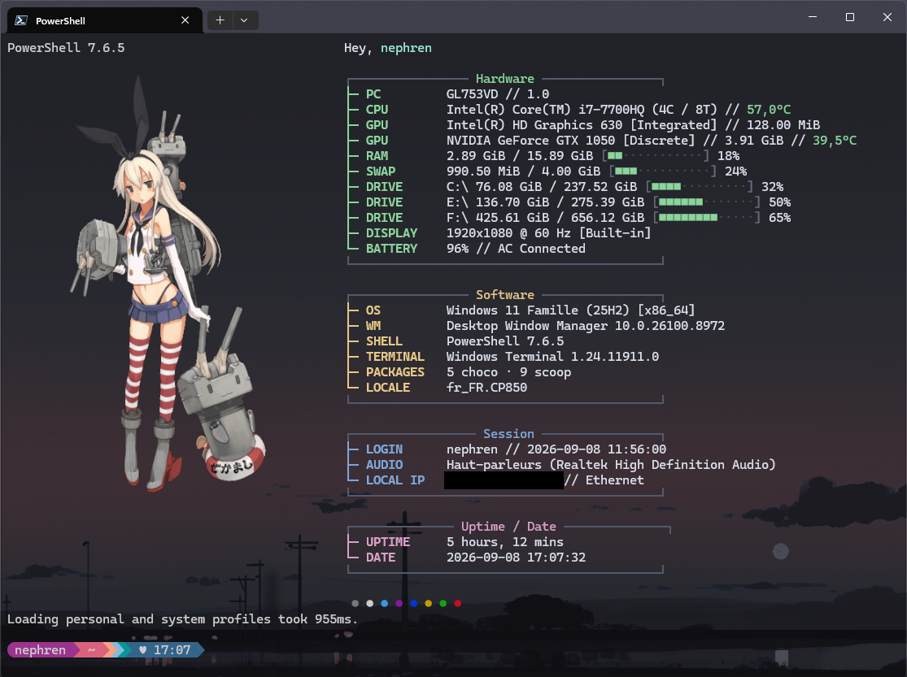

# fastfetch-ricing

🇬🇧 [Read in English](./README.md)



Une config [Fastfetch](https://github.com/fastfetch-cli/fastfetch) pour Windows 11 / PowerShell, avec :

- Un logo personnalisé affiché en Sixel (image au choix, non fournie — voir plus bas)
- Quatre blocs regroupés : **Hardware**, **Software**, **Session**, **Uptime / Date**
- Une palette de couleurs cohérente (vert/jaune/bleu/violet) sur fond sombre
- Barres de progression pour RAM, Swap et disques

## Prérequis

| Outil | Rôle | Lien |
|---|---|---|
| [Fastfetch](https://github.com/fastfetch-cli/fastfetch) | Génère l'affichage système | `winget install fastfetch` ou `scoop install fastfetch` |
| Terminal compatible Sixel | Affiche le logo en image (Windows Terminal ≥ 1.22, WezTerm, mintty…) | [Windows Terminal](https://github.com/microsoft/terminal) |
| [ImageMagick](https://imagemagick.org/) | Convertit votre image en `.six` | `winget install ImageMagick.ImageMagick` |
| PowerShell 7+ | Pour charger le snippet de profil | `winget install Microsoft.PowerShell` |

> Le module `packages` liste Chocolatey/Scoop et le module `wm` peut être vide sous Windows — c'est normal, Fastfetch masque les champs non applicables.

## Installation

1. **Cloner le repo** (ou juste copier `config.jsonc`) dans un dossier stable, par exemple :
   ```powershell
   git clone https://github.com/<votre-user>/fastfetch-ricing.git C:\Scripts\fastfetch-configs\fastfetch-ricing
   ```

2. **Générer votre propre logo en Sixel** à partir d'une image de votre choix (PNG/JPG, fond transparent recommandé) :
   ```powershell
   magick convert "votre-image.png" -resize 200x -background none sixel:"C:\Scripts\fastfetch-configs\fastfetch-ricing\manga.six"
   ```
   - Ajustez `-resize 200x` selon la largeur souhaitée (200 px donne un bon rendu pour `width: 40` dans la config).
   - Si votre build d'ImageMagick n'a pas le delegate `sixel`, utilisez [libsixel](https://github.com/saitoha/libsixel) à la place :
     ```powershell
     img2sixel -w 200 "votre-image.png" > "C:\Scripts\fastfetch-configs\fastfetch-ricing\manga.six"
     ```
   - Le fichier `manga.six` doit rester **à la racine** du dossier (référencé via `%FASTFETCH_EAGLE_ROOT%/manga.six` dans `config.jsonc`).

3. **Ajouter le snippet à votre profil PowerShell** :
   ```powershell
   notepad $PROFILE
   ```
   Collez le contenu de [`profile-snippet.ps1`](./profile-snippet.ps1), puis modifiez la ligne :
   ```powershell
   $eagleFastfetchRoot = 'C:\Scripts\fastfetch-configs\fastfetch-ricing'
   ```
   pour pointer vers votre dossier réel.

4. **Recharger le profil** :
   ```powershell
   . $PROFILE
   ```

## Personnalisation

- **Couleurs** : modifiez les codes hexadécimaux dans `display.color` et dans chaque bloc `custom`/`keyColor` de `config.jsonc`.
- **Sections** : chaque bloc `Hardware` / `Software` / `Session` / `Uptime / Date` est un ensemble de modules encadré par deux entrées `"type": "custom"` (bordures `┌─...─┐` / `└─...─┘`). Ajoutez ou retirez des modules entre les deux pour composer vos propres sections.
- **Taille du logo** : ajustez `logo.width` / `logo.height` dans `config.jsonc` selon la résolution de votre `.six`.

## À propos du logo

Le fichier `manga.six` **n'est volontairement pas inclus** dans ce repo : il s'agit d'une image dérivée dont les droits ne m'appartiennent pas. Suivez les instructions ci-dessus avec une image de votre choix (artwork libre de droits, photo perso, logo, etc.).

## Licence

MIT — voir [LICENSE](./LICENSE). Ne couvre que les fichiers de ce repo (`config.jsonc`, `profile-snippet.ps1`), pas les logiciels tiers (Fastfetch, ImageMagick) ni les images que vous y intégrez vous-même.
